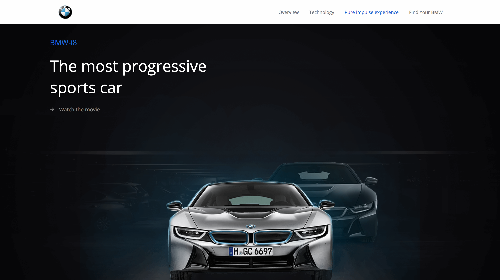

# HETIC P2020 13
> Front-End Development project, BMW i8 website

> One trimester school project

> Online version :point_right: [here](https://bmw.netlify.com/)


[]()
[]()


Product website of the BMW i8, new electric car by BMW.



## Prequisites
- <a href="https://www.npmjs.com/get-npm">NPM</a>

- <a href="https://nodejs.org/en/">Node</a>

- Gulp 3.9.1
```shell
npm install --save gulp-install
```

## Installation

- Open project folder
```shell
cd hetic-p2020-13
```
* Install packages
```shell
npm install
```

## Building & Running

* Run Gulp
```shell
npm build
```

## Usage example

This web site was created to promote the new BMWi8.
The idea was to create a website with the brand identity and respect the product identity.


## Authors
Project manager and developer: Robin Chateau
[@robsiii](https://github.com/robsiii)

Lead developer : Antoine de la Fouchardière
[@antoinedlf](https://github.com/antoinedlf)

Developer : Kyle Hazan
[@kyle-hzn](https://github.com/kyle-hzn)

Developer : Florian Corteel
[@florian-crtl](https://github.com/florian-crtl)

Lead designer : Adrien Laurent
[@adrienlaurent](https://www.behance.net/adrienlaur1f2a)


## Built with

- NPM
- Gulp
- Stylus
- Babel
- Netlify
- Smooth-scroll (Chris Ferdinand MIT License)
- Google Maps API

## Contributing

1. Fork it (<https://github.com/antoinedlf/hetic-p2020-13.git>)
2. Create your feature branch (`git checkout -b feature/fooBar`)
3. Commit your changes (`git commit -am 'Add some fooBar'`)
4. Push to the branch (`git push origin feature/fooBar`)
5. Create a new Pull Request
