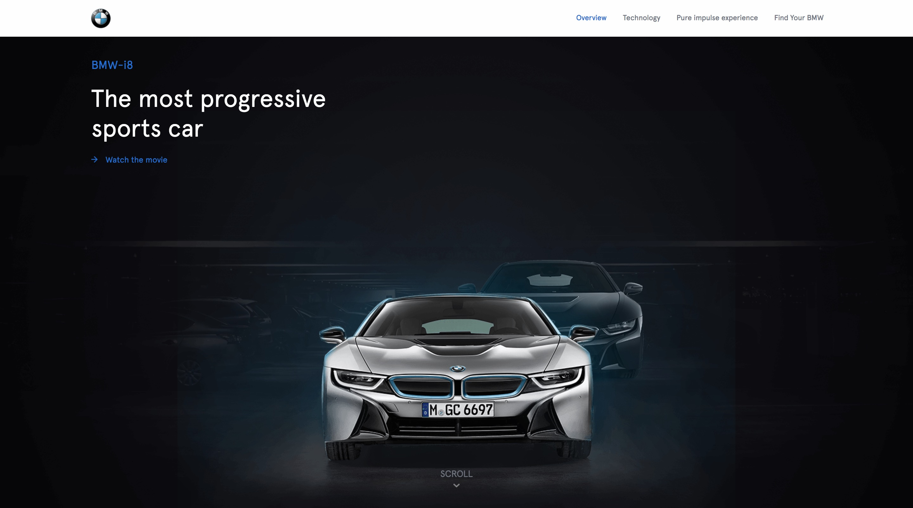

# HETIC P2020 13
> Front-End Development project, BMW i8 website

> One trimester school project

[![NPM Version][npm-image]][npm-url]

Product website of the BMW i8, new electric car by BMW.



## Installation

- Open project folder
```shell
cd hetic-p2020-13
```
* Install packages
```shell
npm install
```
* Run Gulp
```shell
npm start
```

## Usage example

This web site was created to promote the new BMWi8.
The idea was to create a website with the brand identity and respect the product identity.


## Meta
Project manager and developer: Robin Chateau
[@robsiii](https://github.com/robsiii)

Lead developer : Antoine de la Fouchardière
[@antoinedlf](https://github.com/antoinedlf)

Developer : Kyle Hazan
[@kyle-hzn](https://github.com/kyle-hzn)

Developer : Florian Corteel
[@florian-crtl](https://github.com/florian-crtl)

Lead designer : Adrien Laurent
[@adrienlaurent](https://www.behance.net/adrienlaur1f2a)


## Contributing

1. Fork it (<https://github.com/antoinedlf/hetic-p2020-13.git>)
2. Create your feature branch (`git checkout -b feature/fooBar`)
3. Commit your changes (`git commit -am 'Add some fooBar'`)
4. Push to the branch (`git push origin feature/fooBar`)
5. Create a new Pull Request

<!-- Markdown link & img dfn's -->
[npm-image]: https://img.shields.io/npm/v/datadog-metrics.svg?style=flat-square
[npm-url]: https://npmjs.org/package/datadog-metrics
[npm-downloads]: https://img.shields.io/npm/dm/datadog-metrics.svg?style=flat-square
[travis-image]: https://img.shields.io/travis/dbader/node-datadog-metrics/master.svg?style=flat-square
[travis-url]: https://travis-ci.org/dbader/node-datadog-metrics
[wiki]: https://github.com/yourname/yourproject/wiki
